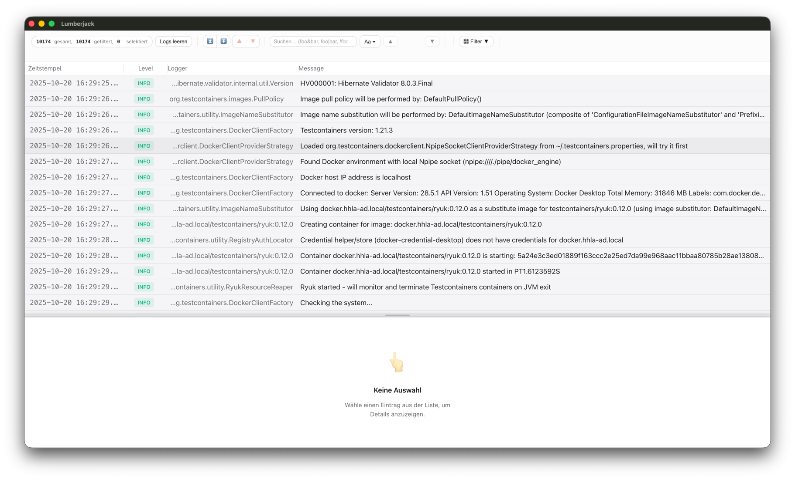
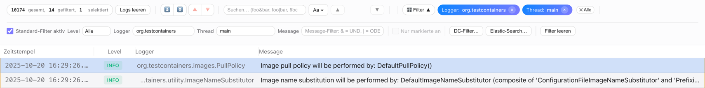
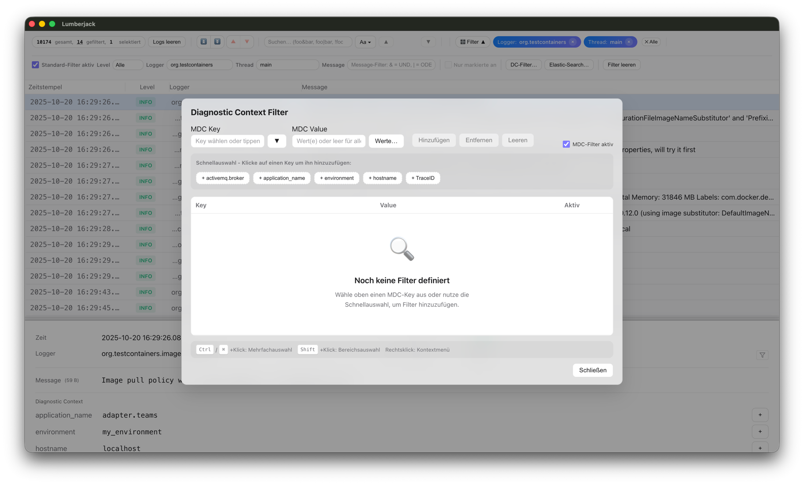
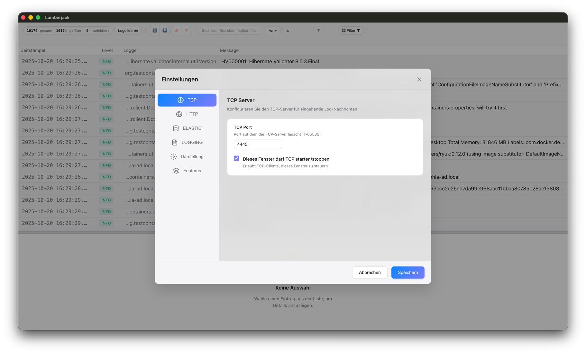

# 🪓 Lumberjack

Ein schneller, schlanker Electron-basierter Log-Viewer mit leistungsfähigen Filtern.

[](package.json)
[](LICENSE)
[](https://electronjs.org)

---

## 📸 Screenshots

### Hauptansicht


### Filter in Aktion


### MDC/Diagnostic Context Filter


### Elasticsearch Integration


### Einstellungen


---

## ✨ Features

- **Leistungsstarke Filter**: UND (`&`), ODER (`|`), NICHT (`!`) Operatoren
- **Schneller Startup**: < 2 Sekunden Kaltstart
- **Effizientes Rendering**: 100.000+ Log-Einträge bei 60 FPS
- **TCP Log-Empfang**: Echtzeit Log-Streaming
- **Cross-Platform**: Windows, macOS, Linux

---

## 📡 TCP Log-Streaming Konfiguration

Lumberjack kann Logs in Echtzeit über TCP empfangen. Konfiguriere deine Anwendung, um Logs an Lumberjack zu senden:

### Logback (logback.xml)

```xml
<?xml version="1.0" encoding="UTF-8"?>
<configuration>
    <!-- Konsolen-Appender für lokale Ausgabe -->
    <appender name="CONSOLE" class="ch.qos.logback.core.ConsoleAppender">
        <encoder>
            <pattern>%d{yyyy-MM-dd HH:mm:ss.SSS} [%thread] %-5level %logger{36} - %msg%n</pattern>
        </encoder>
    </appender>

    <!-- TCP Socket-Appender für Lumberjack -->
    <appender name="LUMBERJACK" class="ch.qos.logback.classic.net.SocketAppender">
        <remoteHost>localhost</remoteHost>
        <port>4560</port>
        <reconnectionDelay>10000</reconnectionDelay>
        <includeCallerData>true</includeCallerData>
    </appender>

    <root level="INFO">
        <appender-ref ref="CONSOLE"/>
        <appender-ref ref="LUMBERJACK"/>
    </root>
</configuration>
```

### Log4j2 (log4j2.xml)

```xml
<?xml version="1.0" encoding="UTF-8"?>
<Configuration status="WARN">
    <Appenders>
        <Console name="Console" target="SYSTEM_OUT">
            <PatternLayout pattern="%d{yyyy-MM-dd HH:mm:ss.SSS} [%t] %-5level %logger{36} - %msg%n"/>
        </Console>

        <!-- TCP Socket für Lumberjack -->
        <Socket name="Lumberjack" host="localhost" port="4560" protocol="TCP">
            <PatternLayout pattern="%d{yyyy-MM-dd HH:mm:ss.SSS} [%t] %-5level %logger{36} - %msg%n"/>
        </Socket>
    </Appenders>

    <Loggers>
        <Root level="info">
            <AppenderRef ref="Console"/>
            <AppenderRef ref="Lumberjack"/>
        </Root>
    </Loggers>
</Configuration>
```

### Log4j 1.x (log4j.properties)

```properties
# Konsolen-Appender
log4j.appender.console=org.apache.log4j.ConsoleAppender
log4j.appender.console.layout=org.apache.log4j.PatternLayout
log4j.appender.console.layout.ConversionPattern=%d{yyyy-MM-dd HH:mm:ss.SSS} [%t] %-5p %c{1} - %m%n

# TCP Socket für Lumberjack
log4j.appender.lumberjack=org.apache.log4j.net.SocketAppender
log4j.appender.lumberjack.remoteHost=localhost
log4j.appender.lumberjack.port=4560
log4j.appender.lumberjack.reconnectionDelay=10000

# Root Logger
log4j.rootLogger=INFO, console, lumberjack
```

> 💡 **Tipp**: In Lumberjack den TCP-Port unter *Einstellungen → TCP Port* konfigurieren (Standard: 4560)

---

### Filter-Beispiele

```
error|warn           → Nachrichten mit "error" ODER "warn"
service&timeout      → Nachrichten mit "service" UND "timeout"
QcStatus&!CB23       → "QcStatus", aber NICHT "CB23"
```

---

## 🚀 Schnellstart

### Voraussetzungen
- Node.js LTS (18+)
- npm

### Entwicklung

```bash
# Installation
npm install

# Entwicklungsmodus starten
npm run dev

# Tests ausführen
npm test
```

### Build

```bash
# Windows Portable
npm run build:portable:x64

# Windows Installer (NSIS)
npm run build:x64

# macOS DMG
npm run build:mac:dmg
```

Build-Artefakte befinden sich in `release/build/`.

### Installation

> ⚠️ **Hinweis:** Beim ersten Start kann eine Sicherheitswarnung erscheinen, da die App nicht signiert ist.
>
> - **macOS**: Rechtsklick → "Öffnen" → "Öffnen" bestätigen
> - **Windows**: "Weitere Informationen" → "Trotzdem ausführen"
>
> Siehe [Troubleshooting](docs/user/TROUBLESHOOTING_AND_FAQ.md#️-sicherheitswarnungen-beim-ersten-start) für Details.

---

## 📦 Projekt-Struktur

```
lumberjack/
├── src/
│   ├── main/         # Electron Main Process
│   └── renderer/     # React/Preact UI
├── assets/           # Icons (ico, icns)
├── docs/             # Dokumentation
├── scripts/          # Build & Test Scripts
└── release/          # Build Output
```

---

## 📖 Dokumentation

Die vollständige Dokumentation befindet sich im [`docs/`](docs/INDEX.md) Ordner:

| Thema | Dokument |
|-------|----------|
| **Übersicht** | [docs/INDEX.md](docs/INDEX.md) |
| **Deployment** | [docs/DEPLOYMENT_GUIDE.md](docs/DEPLOYMENT_GUIDE.md) |
| **Troubleshooting** | [docs/user/TROUBLESHOOTING_AND_FAQ.md](docs/user/TROUBLESHOOTING_AND_FAQ.md) |
| **Performance** | [docs/developer/PERFORMANCE.md](docs/developer/PERFORMANCE.md) |
| **Architektur** | [docs/developer/ARCHITECTURE_DECISION.md](docs/developer/ARCHITECTURE_DECISION.md) |

---

## ⚡ Performance

- **Cold Start**: < 2 Sekunden
- **Warm Start**: < 0.3 Sekunden
- **Bundle Size**: 38 KB (12 KB gzipped)
- **Virtual Scrolling**: 100.000+ Einträge @ 60 FPS

### Production-Ready Features

- ✅ Adaptive Batch Processing
- ✅ Non-blocking File I/O
- ✅ Circuit Breaker Pattern
- ✅ Health Monitoring
- ✅ Rate Limiting

---

## 🔧 Troubleshooting

### Logs finden

| OS | Pfad |
|----|------|
| Windows | `%APPDATA%\Lumberjack\logs\main.log` |
| macOS | `~/Library/Logs/Lumberjack/main.log` |
| Linux | `~/.config/Lumberjack/logs/main.log` |

### Häufige Probleme

| Problem | Lösung |
|---------|--------|
| Icon nicht sichtbar | `npm run icon:generate` ausführen, neu bauen |
| App hängt | Logs prüfen, ggf. `npm run diagnose:memory` |
| Startup langsam | Siehe [Performance-Dokumentation](docs/developer/PERFORMANCE.md) |

Weitere Informationen: [Troubleshooting Guide](docs/user/TROUBLESHOOTING_AND_FAQ.md)

---

## 🛠️ Entwicklung

### Verfügbare Scripts

```bash
npm run dev          # Entwicklungsmodus
npm run build        # Production Build
npm test             # Tests ausführen
npm run lint         # Code prüfen
npm run lint:fix     # Code automatisch korrigieren
npm run format       # Code formatieren
npm run icon:generate # Icons neu generieren
npm run diagnose:memory # Speicher-Diagnose
```

### Architektur

- **Main Process**: Electron, TCP Server, File I/O
- **Renderer Process**: Preact, Virtual Scrolling
- **IPC**: Strukturierte Kommunikation via contextBridge

---

## 📄 Lizenz

[MIT](LICENSE) © Moritz Bohm

---

## 🤝 Contributing

Wir freuen uns über Beiträge! Siehe [CONTRIBUTING.md](CONTRIBUTING.md) für Details.

Kurz-Anleitung:
1. Fork erstellen
2. Feature Branch: `git checkout -b feature/amazing-feature`
3. Commit: `git commit -m 'Add amazing feature'`
4. Push: `git push origin feature/amazing-feature`
5. Pull Request öffnen

---

## 🔒 Security

Sicherheitslücken melden? Siehe [SECURITY.md](SECURITY.md).

