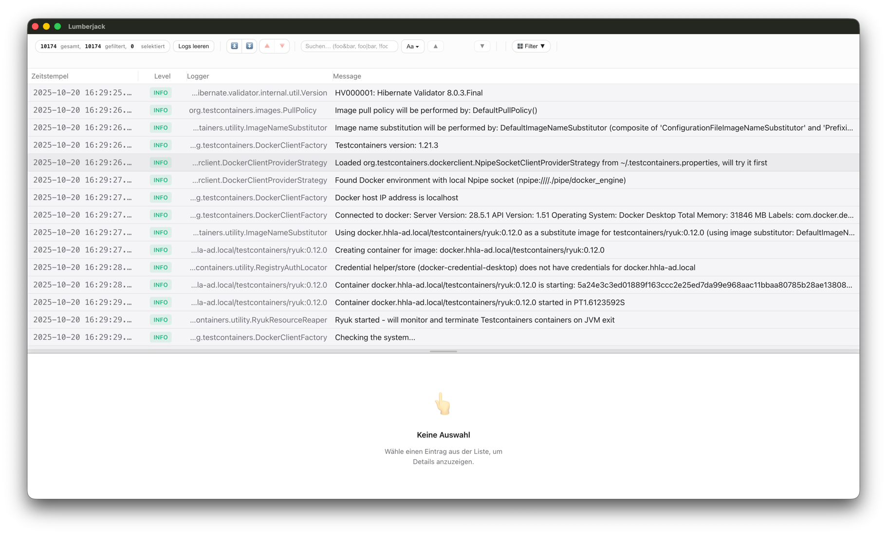
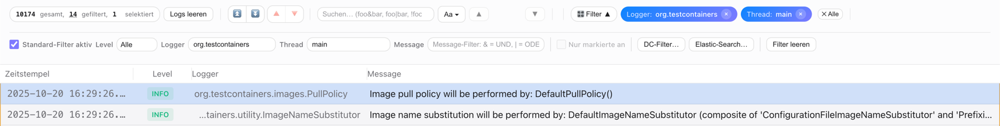
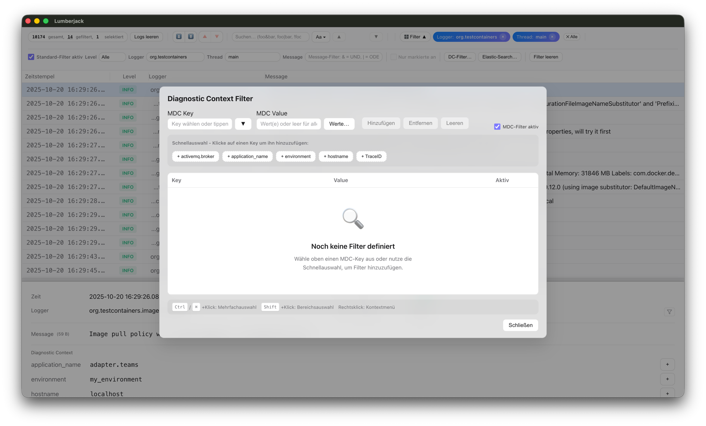
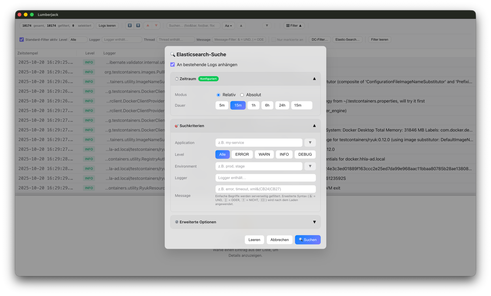
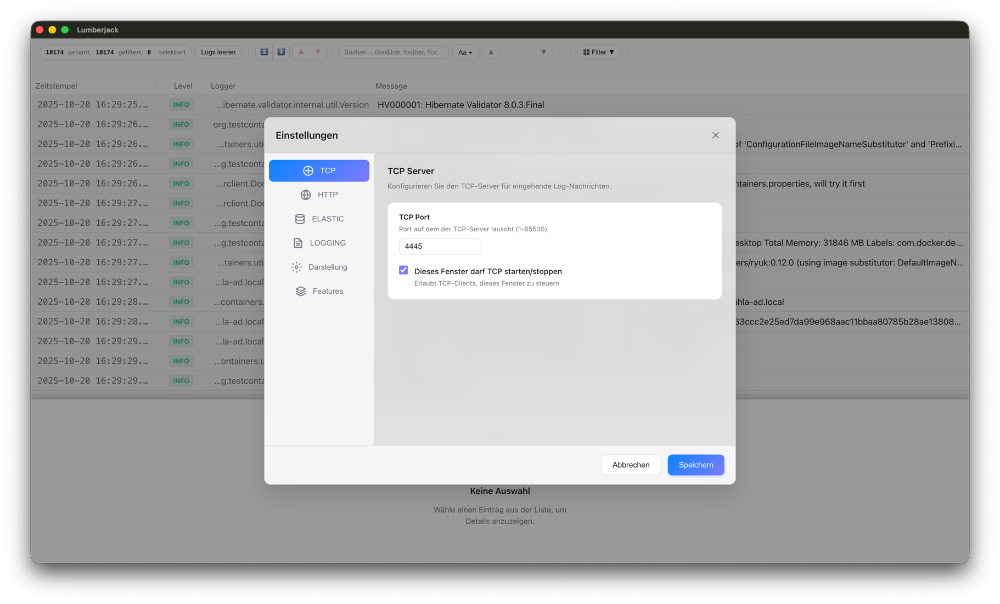

# 🪓 Lumberjack

A fast, lightweight Electron-based log viewer with powerful filtering capabilities.

[](https://github.com/moxbo/lumberjack/releases/latest)
[](LICENSE)
[](https://electronjs.org)
[](https://github.com/moxbo/lumberjack/actions/workflows/ci.yml)
[](https://codecov.io/gh/moxbo/lumberjack)
[](CONTRIBUTING.md)
[](#-quick-start)

---

## 📸 Screenshots

### Main View


### Filter in Action


### MDC/Diagnostic Context Filter


### Elasticsearch Integration


### Settings


---

## ✨ Features

- **Powerful Filters**: AND (`&`), OR (`|`), NOT (`!`) operators
- **Filter Profiles**: Save, search, import/export and undo filter sets
- **Fast Startup**: < 2 seconds cold start
- **Efficient Rendering**: 100,000+ log entries at 60 FPS
- **TCP Log Reception**: Real-time log streaming
- **HTTP Tailing**: Incremental Range-based polling of remote log endpoints
- **File Watcher Tail**: Live-tailing of local log files (with rotation handling)
- **Elasticsearch Integration**: Query and view logs from Elasticsearch
- **MDC/Diagnostic Context**: Filter by diagnostic context fields
- **Bookmarks**: Mark and quickly jump to important log entries
- **Alert Rules**: Define rules and get notified when logs match
- **Auto-Updater**: Automatic updates on installed builds (portable mode auto-detected)
- **Internationalization**: German and English UI (`de` / `en`)
- **Accessibility**: Aria-live announcements, reduced-motion support, keyboard-friendly dialogs
- **Cross-Platform**: Windows, macOS, Linux

---

## 📡 TCP Log-Streaming Configuration

Lumberjack can receive logs in real-time via TCP. Configure your application to send logs to Lumberjack:

### Logback (logback.xml)

Lumberjack expects **JSON-formatted logs** via TCP. Use the `LogstashTcpSocketAppender` with `LogstashEncoder`:

```xml
<?xml version="1.0" encoding="UTF-8"?>
<configuration>
    <!-- Console appender for local output -->
    <appender name="CONSOLE" class="ch.qos.logback.core.ConsoleAppender">
        <encoder>
            <pattern>%d{yyyy-MM-dd HH:mm:ss.SSS} [%thread] %-5level %logger{36} - %msg%n</pattern>
        </encoder>
    </appender>

    <!-- TCP Socket appender for Lumberjack (JSON format) -->
    <appender name="LUMBERJACK" class="net.logstash.logback.appender.LogstashTcpSocketAppender">
        <destination>localhost:4445</destination>
        <encoder class="net.logstash.logback.encoder.LogstashEncoder">
            <includeContext>false</includeContext>
        </encoder>
    </appender>

    <!-- Async wrapper for better performance (optional) -->
    <appender name="ASYNC_LUMBERJACK" class="ch.qos.logback.classic.AsyncAppender">
        <queueSize>500</queueSize>
        <discardingThreshold>0</discardingThreshold>
        <appender-ref ref="LUMBERJACK"/>
    </appender>

    <root level="INFO">
        <appender-ref ref="CONSOLE"/>
        <appender-ref ref="ASYNC_LUMBERJACK"/>
    </root>
</configuration>
```

> **Note:** You need the `logstash-logback-encoder` dependency in your project:
> ```xml
> <dependency>
>     <groupId>net.logstash.logback</groupId>
>     <artifactId>logstash-logback-encoder</artifactId>
>     <version>9.0</version>
> </dependency>
> ```

### Log4j2 (log4j2.xml)

```xml
<?xml version="1.0" encoding="UTF-8"?>
<Configuration status="WARN">
    <Appenders>
        <Console name="Console" target="SYSTEM_OUT">
            <PatternLayout pattern="%d{yyyy-MM-dd HH:mm:ss.SSS} [%t] %-5level %logger{36} - %msg%n"/>
        </Console>

        <!-- TCP Socket for Lumberjack -->
        <Socket name="Lumberjack" host="localhost" port="4445" protocol="TCP">
            <PatternLayout pattern="%d{yyyy-MM-dd HH:mm:ss.SSS} [%t] %-5level %logger{36} - %msg%n"/>
        </Socket>
    </Appenders>

    <Loggers>
        <Root level="info">
            <AppenderRef ref="Console"/>
            <AppenderRef ref="Lumberjack"/>
        </Root>
    </Loggers>
</Configuration>
```

### Log4j 1.x (log4j.properties)

```properties
# Console appender
log4j.appender.console=org.apache.log4j.ConsoleAppender
log4j.appender.console.layout=org.apache.log4j.PatternLayout
log4j.appender.console.layout.ConversionPattern=%d{yyyy-MM-dd HH:mm:ss.SSS} [%t] %-5p %c{1} - %m%n

# TCP Socket for Lumberjack
log4j.appender.lumberjack=org.apache.log4j.net.SocketAppender
log4j.appender.lumberjack.remoteHost=localhost
log4j.appender.lumberjack.port=4445
log4j.appender.lumberjack.reconnectionDelay=10000

# Root Logger
log4j.rootLogger=INFO, console, lumberjack
```

> 💡 **Tip**: Configure the TCP port in Lumberjack under *Settings → TCP Port* (default: 4445)

---

### Filter Examples

```
error|warn           → Messages containing "error" OR "warn"
service&timeout      → Messages containing "service" AND "timeout"
QcStatus&!CB23       → "QcStatus", but NOT "CB23"
```

---

## 🚀 Quick Start

### Prerequisites
- Node.js 22.12+ (LTS)
- npm

### Installation

#### macOS (Homebrew)

```bash
brew tap moxbo/tap
brew install --cask lumberjack
```

#### macOS / Windows / Linux (Manual)

Download the latest release from [GitHub Releases](https://github.com/moxbo/lumberjack/releases/latest):
- **macOS**: `Lumberjack-x.x.x-arm64.dmg` or `Lumberjack-x.x.x-x64.dmg`
- **Windows**: `Lumberjack-x.x.x-portable.exe` or `Lumberjack-Setup-x.x.x.exe`
- **Linux**: `Lumberjack-x.x.x.AppImage`

### Development

```bash
# Install dependencies
npm install

# Start development mode
npm run dev

# Run tests
npm test
```

### Build

```bash
# Windows Portable
npm run build:portable:x64

# Windows Installer (NSIS)
npm run build:x64

# macOS DMG
npm run build:mac:dmg
```

Build artifacts are located in `release/build/`.

### Installation

> ⚠️ **Note:** On first launch, you may see a security warning because the app is not signed with an Apple Developer certificate.
>
> **macOS** (if you see "damaged or incomplete" message):
> ```bash
> # Open Terminal and run:
> xattr -cr /Applications/Lumberjack.app
> # Or for DMG files in the Downloads folder:
> xattr -cr ~/Downloads/Lumberjack*.dmg
> ```
> Alternatively: Right-click → "Open" → Confirm "Open"
>
> **Windows**: Click "More info" → "Run anyway"
>
> See [Troubleshooting](docs/user/TROUBLESHOOTING_AND_FAQ.md) for more details.

---

## 📦 Project Structure

```
lumberjack/
├── src/
│   ├── main/         # Electron Main Process
│   └── renderer/     # React/Preact UI
├── assets/           # Icons (ico, icns)
├── docs/             # Documentation
├── scripts/          # Build & Test Scripts
└── release/          # Build Output
```

---

## 📖 Documentation

Full documentation is available in the [`docs/`](docs/INDEX.md) folder:

| Topic | Document |
|-------|----------|
| **Overview** | [docs/INDEX.md](docs/INDEX.md) |
| **Deployment** | [docs/DEPLOYMENT_GUIDE.md](docs/DEPLOYMENT_GUIDE.md) |
| **Troubleshooting** | [docs/user/TROUBLESHOOTING_AND_FAQ.md](docs/user/TROUBLESHOOTING_AND_FAQ.md) |
| **Performance** | [docs/developer/PERFORMANCE.md](docs/developer/PERFORMANCE.md) |
| **Architecture** | [docs/developer/ARCHITECTURE_DECISION.md](docs/developer/ARCHITECTURE_DECISION.md) |

---

## ⚡ Performance

- **Cold Start**: < 2 seconds
- **Warm Start**: < 0.3 seconds
- **Bundle Size**: 38 KB (12 KB gzipped)
- **Virtual Scrolling**: 100,000+ entries @ 60 FPS

### Production-Ready Features

- ✅ Adaptive Batch Processing
- ✅ Non-blocking File I/O
- ✅ Circuit Breaker Pattern
- ✅ Health Monitoring
- ✅ Rate Limiting

---

## 🔧 Troubleshooting

### Finding Logs

| OS | Path |
|----|------|
| Windows | `%APPDATA%\Lumberjack\logs\main.log` |
| macOS | `~/Library/Logs/Lumberjack/main.log` |
| Linux | `~/.config/Lumberjack/logs/main.log` |

### Common Issues

| Problem | Solution |
|---------|----------|
| Icon not visible | Run `npm run icon:generate`, then rebuild |
| App hangs | Check logs, run `npm run diagnose:memory` |
| Slow startup | See [Performance docs](docs/developer/PERFORMANCE.md) |

More information: [Troubleshooting Guide](docs/user/TROUBLESHOOTING_AND_FAQ.md)

---

## 🛠️ Development

### Available Scripts

```bash
npm run dev          # Development mode
npm run build        # Production build
npm test             # Run tests
npm run lint         # Check code
npm run lint:fix     # Auto-fix code issues
npm run format       # Format code
npm run icon:generate # Regenerate icons
npm run diagnose:memory # Memory diagnostics
```

### Release Workflow

The version is automatically determined from Git tags:

```bash
# 1. Create tag (version without "v" is used in the app)
git tag v1.0.5

# 2. Push
git push && git push --tags

# 3. Build (version is automatically taken from tag)
npm run build:portable:x64  # Windows
npm run build:mac:dmg       # macOS
```

**Version Logic:**
- **Exact tag on HEAD**: `v1.0.5` → Version `1.0.5`
- **Commits after tag**: `v1.0.5` + 3 commits → Version `1.0.5-dev.3`
- **Environment variable**: `RELEASE_VERSION=1.2.0` overrides all

### Architecture

- **Main Process**: Electron, TCP Server, File I/O
- **Renderer Process**: Preact, Virtual Scrolling
- **IPC**: Structured communication via contextBridge

---

## 📄 License

[MIT](LICENSE) © Moritz Bohm

---

## 🤝 Contributing

Contributions are welcome! See [CONTRIBUTING.md](CONTRIBUTING.md) for details.

Quick guide:
1. Fork the repository
2. Create feature branch: `git checkout -b feature/amazing-feature`
3. Commit: `git commit -m 'Add amazing feature'`
4. Push: `git push origin feature/amazing-feature`
5. Open a Pull Request

---

## 🔒 Security

Found a security vulnerability? See [SECURITY.md](SECURITY.md).

